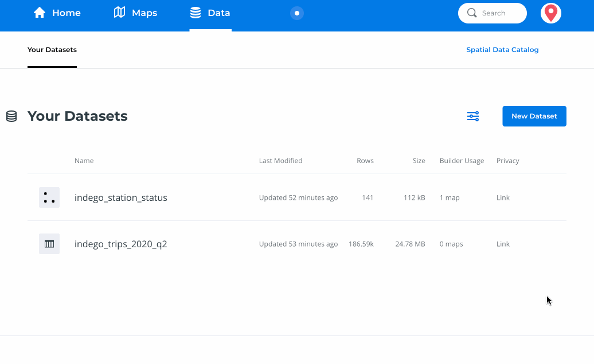
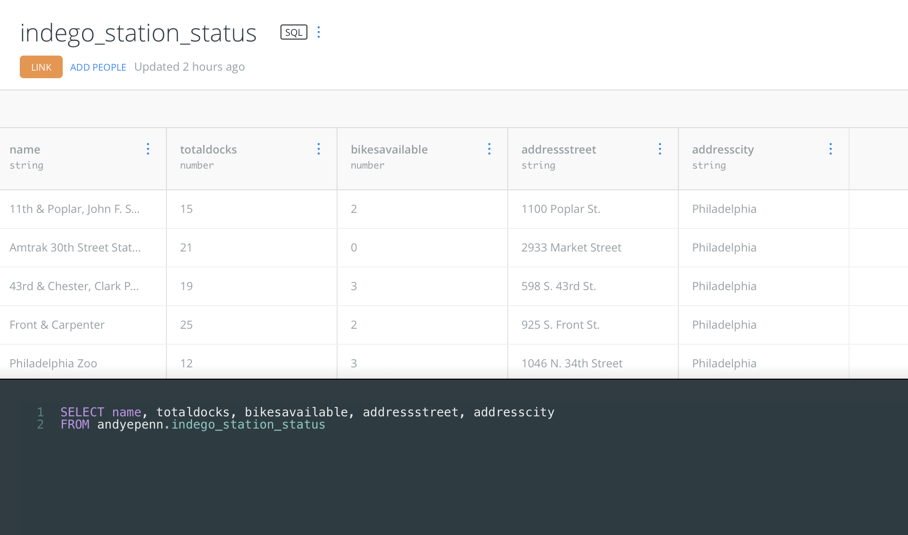
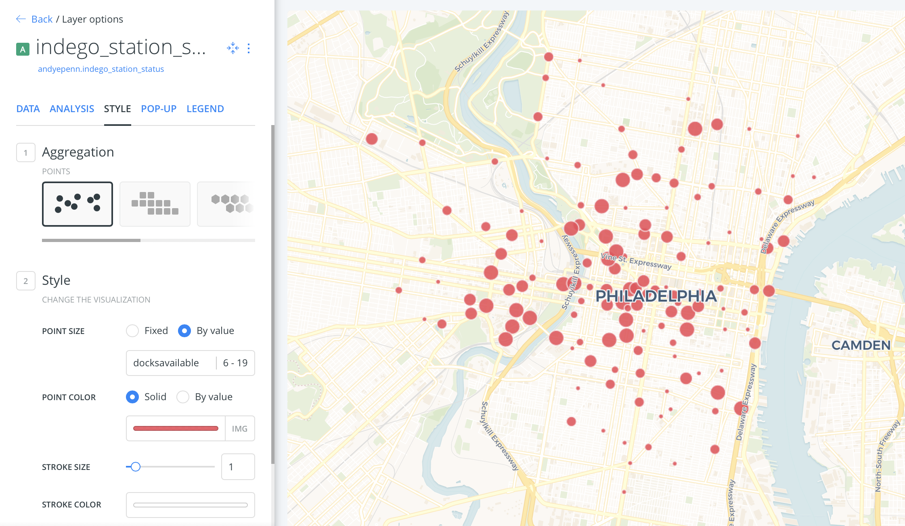

# Lab - Week 1 - Intro to (Spatial) SQL

Below we demonstrate basic SQL by query results using a mapping library that works in the notebook.

**Follow along by tinkering with the code! Don't be afraid to make a mistake. Remember that CMD+Z/CTRL+Z will return you to your previous edit.**

We will look at bikeshare data for Philadelphia.


All data is available at: https://www.rideindego.com/about/data/

## Goals of this lab

* Query spatial data
    * SQL keywords covered: SELECT, FROM, WHERE
    * Data types
    * Geometry columns
* Visualize data using a cloud based mapping platform (Carto)

## Load Indego Station Status Data

The data is located in our class GitHub: https://github.com/MUSA-509/week-1-introductions/blob/master/data/indego_station_status.geojson

I originally pulled it from Indego's [station status endpoint](http://www.rideindego.com/stations/json/).
        
Take a look at how GitHub renders it -- an interactive map! Notice that it is a [Mapbox](https://www.mapbox.com/) basemap. Toggle the map view with the data blob view to get a preview of a GeoJSON file. We will encounter GeoJSON files a lot this semester.

<a href="https://github.com/MUSA-509/week-1-introductions/blob/master/data/indego_station_status.geojson"></a>

Let's pull it into your CARTO account.

1. Copy this URL: `https://raw.githubusercontent.com/MUSA-509/week-1-introductions/master/data/indego_station_status.geojson`
1. Import the data into your CARTO account by pasting into the `upload via URL` field


## Exploring the dataset with some SQL

### Default Query

Let's look at just a few of the columns. A few things to notice about the default query.

```SQL
SELECT *
FROM andyepenn.indego_station_status
```

* `SELECT *` means return all columns (e.g., the_geom, id, name, coordinates, totaldocks, ...)
* `FROM` is a keyword meaning pull data from the table following it
* `andyepenn.indego_station_status` is the name of table. Actually, `indego_station_status` is the name of the table. The `andyepenn` refers to my account (technically it's an organization identifier of the database called a schema). Each user within our class org will have a different schema.


**NOTE: You will need to change the schema name for all of the queries below to your username instead of mine**

### SELECT

Instead of choosing all of the columns (`*`), let's choose only a couple that are of interest.

```SQL
SELECT name, totaldocks, bikesavailable, addressstreet, addresscity
FROM andyepenn.indego_station_status
```

Notice that the result is only a subset of the data.




```SQL
SELECT name, totaldocks, bikesavailable, addressstreet, addresscity
FROM andyepenn.indego_station_status
```

### LIMIT

To return only some of the rows, we can use another keyword `LIMIT` to limit the number of rows returned.

```SQL
SELECT name, totaldocks, bikesavailable, addressstreet, addresscity
FROM andyepenn.indego_station_status
LIMIT 5
```

Try changing the limit number to observe the results. Note that Carto will only show 40 rows per page. Use the navigation to view the next 40. This is specific to this webpage/application. If doing this from a database directly, you would get the number of rows you requested if they all exist.

### WHERE

`WHERE` clauses are one place where data can be filtered. Let's find all stations that have more than 10 bikes available.

```SQL
SELECT *
FROM andyepenn.indego_station_status
WHERE bikesavailable > 10
```

### ORDER BY

You can sort your table by one or more columns using the `ORDER BY` keywords.

This query gives you the 10 stations that have the largest numbers of bikes currently.

```SQL
SELECT *
FROM indegogo_stations_status
ORDER BY bikesavailable DESC
LIMIT 10
```

### Aggregation functions

#### `COUNT`
Using [aggregation functions](https://www.postgresql.org/docs/12/functions-aggregate.html), we can get answers like: "How many stations have more than 10 bikes available?" We will use the filter from above, but we only want to know the number of rows that fit the condition. The aggregate function `COUNT` will do this for us.

```SQL
SELECT count(*)
FROM andyepenn.indego_station_status
WHERE bikesavailable > 10
```

#### `SUM`, `AVG`

We can do multiple aggregate functions at the same time:

```SQL
SELECT
    SUM(bikesavailable) as num_bikes_available,
    AVG(bikesavailable) as avg_bikes_available,
    count(*) as num_stations
FROM andyepenn.indego_station_status
```

There are a couple of new things going on here:
1. We're using multiple aggregate functions together in the SELECT
1. We are giving names to the results of those calculations
1. `SUM` and `AVG` are acting on a specific column while `COUNT` is for `*`. We could have done `COUNT(bikesavailable)` too but for reasons we'll discuss later, this doesn't always return the same answer as `COUNT(*)`. If there is missing data (i.e., `null` values), then those will not add to the count. `COUNT(*)` doesn't take nulls into account so will always be the number of rows.

## Make some maps!

First, clear the queries by clicking on the CLEAR button in the lower right.

Next hit "CREATE MAP". Let's make a graduated symbol map (points scaled by a value) based on a column you're interested in.



### Find the SQL panel

It's hidden in the Data tab. :P

### Revisit some of the queries from before

How does this one look visualized? Play with the numbers/columns to see if you can find patterns. This data is as of 10pm on a Thursday. Where are stations empty/full? Where do the electric bikes tend to be?

```SQL
SELECT *
FROM andyepenn.indego_station_status
WHERE bikesavailable > 10
```

### Looking at the geometry column

Let's take a look at the data types in the table. Switch from Map view to Table view. Notice on the heading the data types are below the column names. There are a few important columns for mapping.

* `the_geom` - this is a column of geometries (points, lines, polygons) in WGS84.
* `the_geom_webmercator` - this is a utility column. It has the same data as `the_geom` except that it's projected into Web Mercator (epsg 3857). This is a common projection for maps on the web (e.g., Google Maps).

Let's inspect the geometry column a little.

```SQL
SELECT
    the_geom,
    ST_AsText(the_geom) as wkt_string,
    ST_X(the_geom) as longitude,
    ST_Y(the_geom) as latitude
FROM andyepenn.indego_station_status
```

Checkout the documentation for these functions. They're our first PostGIS functions.

* [ST_AsText](https://postgis.net/docs/ST_AsText.html) - gives the text representation of a geometry, called "well-known text" (WKT)
* [ST_X](https://postgis.net/docs/ST_X.html) - extracts the x coordinate (longitude for WGS84) from a **point**
* [ST_Y](https://postgis.net/docs/ST_Y.html) - extracts the y coordinate (latitude for WGS84) from a **point**

### Asking geographical questions - Stations within 1 kilometer of Meyerson Hall

Our first geographic query will find all stations within 1 kilometer of Meyerson Hall. There's a lot going on in this query so we'll unpack it together.

```SQL
SELECT *
FROM andyepenn.indego_station_status
WHERE ST_DWithin(the_geom::geography, ST_SetSRID(ST_MakePoint(-75.1928193, 39.9523345), 4326)::geography, 1000)
```

* `ST_DWithin` - this is a predicate that returns true or false depending on the inputs: if the two geometries are within the specified distance of one another, ST_DWithin returns True. Otherwise it will return False.
* The `::geography` notation means that we are doing calculations on a spherical surface instead of a 2D plane. Distances calculated in PostGIS this way are returned as meters, so we can specify the number of meters apart as the third argument in the function
* `ST_SetSRID(ST_MakePoint(-75.1928193, 39.9523345), 4326)`: We are creating a point from a longitude/latitude pair and setting the SRID to 4326, the common lat/long system we're used to (WGS84).

## If we have time... but really for next Lab.

Upload one of the trip datasets. For example, I uploaded [Q2 2020](https://u626n26h74f16ig1p3pt0f2g-wpengine.netdna-ssl.com/wp-content/uploads/2020/08/indego-trips-2020-q2.zip).

### Where are origin trips longest?

```SQL
SELECT
  s.id,
  s.the_geom,
  s.the_geom_webmercator,
  s.cartodb_id,
  avg(duration) as avg_duration
FROM andyepenn.indego_trips_2020_q2 as t
JOIN andyepenn.indego_stations_status as s
ON t.start_station = s.id
GROUP BY 1, 2, 3, 4
```

### How do people use Electric bikes differently than non-electric (standard) bikes?

```SQL
SELECT
  s.id, s.the_geom, s.the_geom_webmercator, s.cartodb_id,
  abs(
    avg(
      CASE WHEN bike_type = 'standard'
      THEN ST_Distance(ST_SetSRID(ST_MakePoint(start_lon, start_lat), 4326)::geography, ST_SetSRID(ST_MakePoint(end_lon, end_lat), 4326)::geography)
      ELSE null END
    )
    - avg(
      CASE WHEN bike_type = 'electric'
      THEN ST_Distance(ST_SetSRID(ST_MakePoint(start_lon, start_lat), 4326)::geography, ST_SetSRID(ST_MakePoint(end_lon, end_lat), 4326)::geography)
       ELSE null END
     )
   ) / 1000.0 as avg_distance_diff
FROM andyepenn.indego_trips_2020_q2 as t
JOIN andyepenn.indego_station_status as s
ON t.start_station = s.id
GROUP BY 1, 2, 3, 4
```

## Challenge

Make a map that's easier to read than the one on Indego's website: <https://www.rideindego.com/stations/>.
